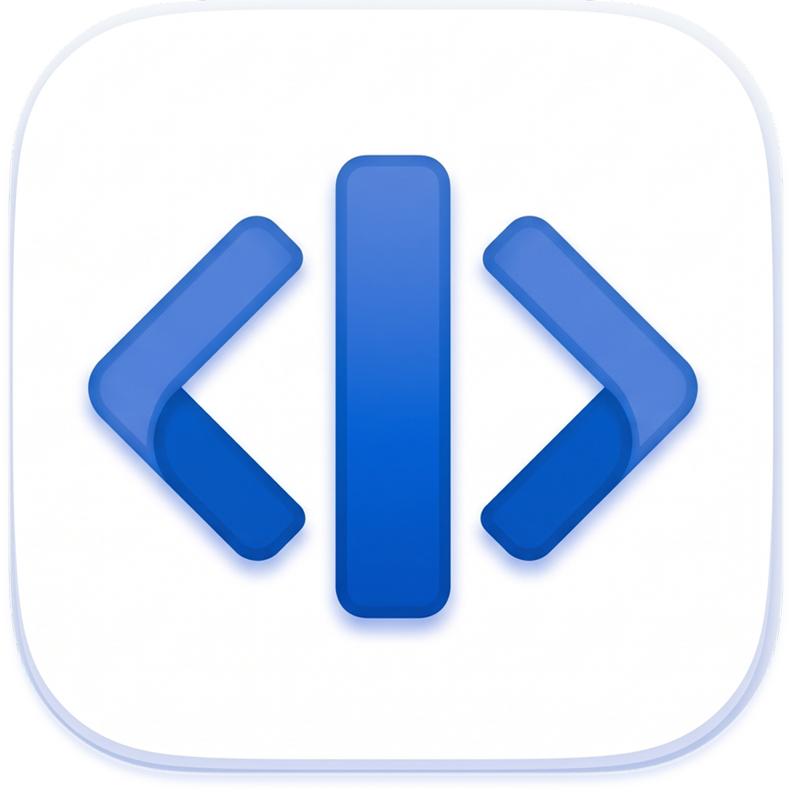
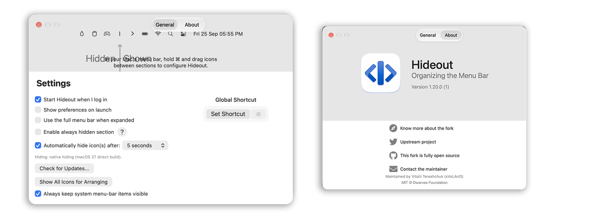

<p align="center">
	
</p>
<p align="center">
<a href="https://github.com/xvoland/hidden/releases/latest">
		
  </a>
</p>

<p align="center">
<a href="https://dotoca.net/hideout">
 		
  </a>
</p>

## Hideout - A Cleaner Mac Menu Bar
Hideout is a lightweight macOS utility that lets you hide unwanted menu bar icons and keep your Mac interface clean and organized.

It is designed for people who have too many background apps, system utilities, and status icons competing for space in the macOS menu bar.

<p align="center">
	
</p>


<p align="center">
	
</p>


## 🚀 Install

These builds are **ad-hoc / unsigned** (`CODE_SIGNING_ALLOWED=NO`) — no Developer ID
signature, no notarization. (Support the project to purchase a signature from Apple.)

macOS ties the Accessibility permission to the code
signature, so after **every update** re-grant it in System Settings when prompted
(first collapse asks again); that is expected, not a bug.

#### Using Homebrew

This fork ships its own Homebrew cask so you install **this** build — not the
upstream one:

```
brew install --cask https://raw.githubusercontent.com/xvoland/hideout/master/Casks/hideout.rb
```

This pulls the latest macOS 27 "Golden Gate" build from the
[xvoland/hidden Releases](https://github.com/xvoland/hideout/releases) page. The build is **unsigned**, so before the first launch run:

```
xattr -dr com.apple.quarantine /Applications/Hideout.app
```

<p align="center">
	
</p>


#### Manual download

- [Download latest version](https://github.com/xvoland/hideout/releases/latest)
- Open and drag the app to the Applications folder.
- Launch Hideout and drag the icon in your menu bar (hold CMD) to the right so it is between some other icons.

## ⚙️ Hiding (macOS 27)

macOS 27 Golden Gate rebuilt the menu bar as a single window. Hiding is always native since v1.19: Hideout asks macOS's private `MenuBarClientCore` (assessment mode) to keep only an allow-list visible. macOS does the hiding/reflow itself — independent of display width, notch, or front app.

Requirements: the **direct (non-sandboxed) build** on **macOS 27** (this GitHub/ad-hoc release, compiled with `HIDDENBAR_NATIVE_VISIBILITY=1`), plus **Accessibility** permission (prompted on first collapse). Where unavailable (sandboxed builds, pre-27), collapsing reports unavailable and the arrow stays put.

## 🤔 Why native hiding?

macOS historically had **no public API** to hide other apps' menu-bar icons. Hideout used a geometry hack: inflate a separator `NSStatusItem` so icons to its left slide out of view.

| macOS era | What changed | Consequence |
|-----------|--------------|-------------|
| **≤ 26 (Ventura/Sonoma/Sequoia)** | Each status item = its own window. Inflating the separator pushes icons off-screen. | Geometry hiding worked. |
| **27 Golden Gate** | Menu bar became **one window** with a native overflow (`«`). Inflating past half the screen width **drops** the item instead of clamping, and length changes no longer displace neighbours. | Geometry hiding is dead on 27 — hiding must go through the system. |
| **27 + private API** | macOS 27 introduced `MenuBarClientCore` (assessment mode) — a private framework that can restrict the menu bar to an allow-list. | **Native hiding** — asks macOS to hide everything except the allow-list. Width-independent, notch-aware. |

Native requires the **direct (non-sandboxed) build**, macOS 27+, and Accessibility permission. It uses a private API Apple may change. For macOS ≤ 26, upstream `dwarvesf/hidden` remains the path.

## 🕹 Usage

* `⌘` + drag icons across the `|` separator: left of it hides on collapse.
  A second, translucent `|` (enable *Always hidden section* in Preferences)
  marks a zone that stays hidden even when expanded.
* Click the Arrow icon to hide menu bar items.
* **Option-click** the arrow or a separator to show/hide separators for
  arranging (reveals everything for `⌘`-dragging). If Option-click does
  nothing on your setup, use Preferences → **Show All Icons for Arranging**.
* Missing an icon after quit/update? Check the system `«` overflow first —
  macOS parks displaced icons there and doesn't always re-seat them.

<p align="center">
	
</p>

## 📚 Documentation

- [Manual](docs/MANUAL.md): every setting, the hidden Terminal-only options, and troubleshooting.
- [Architecture](docs/ARCHITECTURE.md): how the hiding trick works, topology, and known limits.
- [Maintainer runbook](docs/RUNBOOK.md): build, behavioral verification, and release process.

## Requirements
macOS version >= 13.0 (Ventura)

Running an older macOS? The last release supporting macOS 10.13 High Sierra
through 12 Monterey is [upstream v1.10](https://github.com/dwarvesf/hidden/releases/tag/v1.10)
(published by the original Dwarves Foundation project; this fork does not ship
pre-Ventura builds). Later versions require macOS 13 because autostart moved to the
`SMAppService` API introduced there.

## You may also like
- [Blurred](https://github.com/dwarvesf/Blurred) - A macOS utility that helps reduce distraction by dimming your inactive noise
- [Micro Sniff](https://github.com/dwarvesf/micro-sniff) - An ultra-light macOS utility that notify whenever your micro-device is being used
- [VimMotion](https://github.com/dwarvesf/VimMotionPublic) Vim style shortcut for MacOS


> ⚠️ **WARNING: UNOFFICIAL BUILD**
> 
> This is a community fork of [Hidden Bar](https://github.com/dwarvesf/hidden) maintained by **Vitalii Tereshchuk (xVoLAnD)** — https://dotoca.net, with added support for **macOS 27 Golden Gate**.
> 
> It is **NOT** the official Dwarves Foundation release.
> Download the fork build from the [Releases](https://github.com/xvoland/hideout/releases) page.

## Maintainer (this fork)

| Role | Name | Contact |
| --- | --- | --- |
| Fork maintainer, build & macOS 27 verification | Vitalii Tereshchuk (xVoLAnD) | https://dotoca.net/hideout |

Upstream project: [dwarvesf/hidden](https://github.com/dwarvesf/hidden) © Dwarves Foundation. The macOS 27 Golden Gate hide-mechanism fix originates from upstream [PR #396](https://github.com/dwarvesf/hidden/pull/396) by Skyler (skuthus); this fork packages, builds, and verifies it for macOS 27.


## License
MIT &copy; [Dwarves Foundation](https://github.com/dwarvesf)

