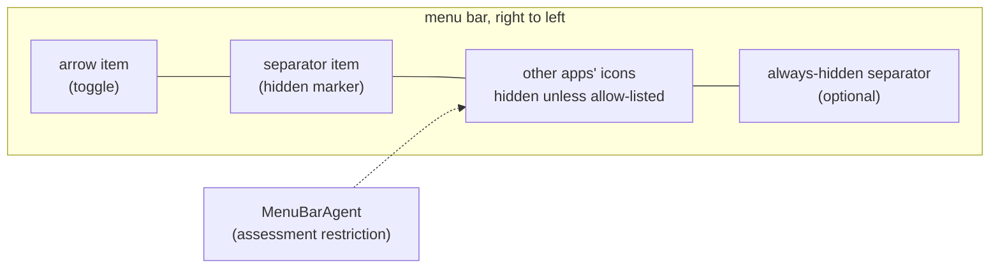
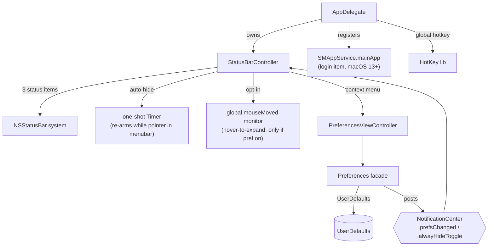

# Architecture

Hidden Bar is a single-process AppKit menubar utility (one dependency:
[HotKey](https://github.com/soffes/HotKey)). There is no helper app, no
daemon, no network. Everything happens inside three `NSStatusItem`s (arrow,
separator, optional always-hidden marker) and one window.

## The core mechanism

macOS offers no API to hide other apps' menubar icons. Since v1.19 hiding is
always native: the engine reads which apps sit in each bar section (via
Accessibility, from an unrestricted bar) and asks macOS itself — through the
private `MenuBarClientCore` framework (assessment mode) — to keep only an
allow-list visible (own bundle, visible-section bundles, Apple system
items/hosts). macOS hides the rest and reflows the bar itself.

Key consequences of this design:

- The menubar replicates on every display; sections are re-read from the
  unrestricted bar on the next collapse (cached ones stand in while a
  restriction is active, because hidden items report stale positions).
- Hiding is per app bundle (the most visible section wins); macOS's own items
  and unattributable extras stay visible.
- Icons macOS inserts to the LEFT of the separator (where new status items
  appear) are in the hidden zone by default.

## Topology

- **`AppDelegate`** (entry): registers default prefs, sets up the global hotkey,
  runs the one-shot legacy login-item migration, owns the `StatusBarController`.
- **`StatusBarController`** (the product, ~370 lines): the three status items,
  collapse/expand, auto-hide timer, interaction-awareness, hover-to-expand,
  self-restore of dragged-off items.
- **`Preferences`** (facade enum): typed accessors over `UserDefaults`; setters
  post `NotificationCenter` notifications that the controller and prefs window
  observe. There is no other state store.
- **`PreferencesViewController` / `PreferencesWindowController`**: the only
  window (storyboard-based), shown on demand from the context menu.

## Behavior layers on the core trick

| Layer | Mechanism | Cost when unused |
|---|---|---|
| Auto-hide | one-shot `Timer` after expand; at fire, if the pointer sits in any screen's menubar band (`visibleFrame.maxY ... frame.maxY`), it re-arms instead of collapsing | none (single point-in-rect check at fire) |
| Hover-to-expand (opt-in) | global `.mouseMoved` monitor + 0.5s dwell timer; installed only when the `hoverToExpand` default is true at launch | zero: monitor not installed |
| Self-restore | `isVisible = true` forced on our items at launch; Cmd-dragging them off otherwise bricks the app (its only UI is those items) | none |
| Always-hidden section | a second separator item; its own length games, gated by `alwaysHiddenSectionEnabled` | item not created |

## Hiding engine (macOS 27)

There is one engine since v1.19 (the Legacy spacer engine, the factory and the
selector were deleted; pre-27 path: upstream `dwarvesf/hidden`):

- **`NativeVisibilityEngine`** — used on the **direct, non-sandboxed** build
  (`HIDDENBAR_NATIVE_VISIBILITY` defined) on macOS 27. It asks macOS's private
  `MenuBarClientCore` (assessment mode) to keep only an allow-list of status items
  visible. Because macOS does the hiding and reflow itself, this is **independent
  of display width, the notch, and the frontmost app's menus**. Requires the
  Accessibility permission (read via the AX API) and does not work inside the
  App Sandbox (the sandbox denies the `axserver` mach-lookup). Where unavailable
  (sandboxed, pre-27) collapsing reports unavailable and the arrow stays put.

**Distribution consequence:** the GitHub/direct (ad-hoc, unsigned) build is compiled
with `HIDDENBAR_NATIVE_VISIBILITY`, so it offers native hiding. Sandboxed lanes
cannot ship it.

## Autostart

macOS 13+ `SMAppService.mainApp`: the app registers itself; the login item is
visible and revocable in System Settings > General > Login Items. On first
launch after upgrade, a one-shot migration deauthorizes the legacy
`com.dwarvesv.LauncherApplication` helper registration (the BTM database never
garbage-collects those; see Apple TN3111). The helper app itself is gone.

## Security posture

The App Store (sandboxed) lane is sandboxed (`com.apple.security.app-sandbox`),
hardened runtime, no network entitlement, no file I/O, no IPC surface, no shell or
subprocess use. The direct/ad-hoc GitHub build is **not** sandboxed (it must reach
the Accessibility server and the private `MenuBarClientCore` for native hiding) and
is distributed unsigned (`xattr -dr com.apple.quarantine` after install). The only
dependency is HotKey (a small Carbon `RegisterEventHotKey` wrapper) locked by the
committed `Package.resolved`. The opt-in hover monitor observes pointer position
only and discards event payloads. About-window links are hardcoded. A full-tree
audit (2026-06) scored 9/10 with hygiene-level findings only.

## Known architectural limits

- **The notch**: hidden icons sit "under" the notch area on notched Macs; the
  trick cannot reveal them there. The real fix is a spillover/second-bar design
  (tracked in issues #357/#341/#148; candidate implementations in PRs #350/#358).
- **macOS 27 always-hidden on wide displays**: with the separators shown,
  expanding reveals the always-hidden section too; it stays hidden only with
  "hide separators" on.
- **macOS 27 first launch after upgrade**: items register under `_v27` autosave
  names. Icons may need a one-time ⌘-drag past the separator, as on a fresh
  install.
- **Other apps' open menus**: interaction-awareness is pointer-position-based;
  a pointer deep inside another app's open dropdown is below the menubar band,
  so the collapse can still fire there.
